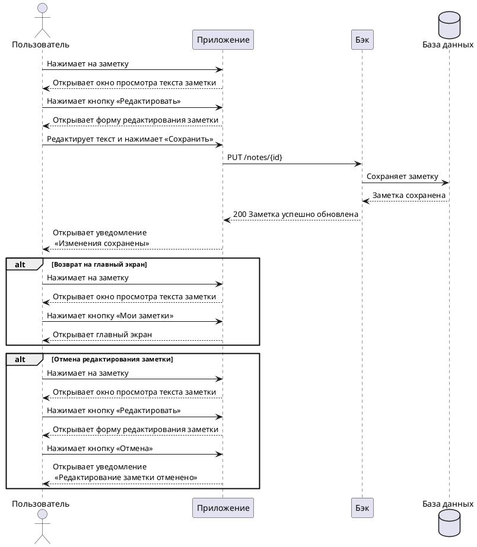

---
tags:
  - Нотсапп
  - UML-диаграмма
---

# Пользовательский сценарий «Редактирование заметки»

## Действующие лица: 

1. Пользователь

2. Приложение

3. Бэк

4. База данных

## Предварительные условия 

1. В системе сохранена хотя бы одна заметка.

2. Пользователь должен находиться на главном экране.

## Выходные условия 

В системе обновлена заметка пользователя. 

## Основной сценарий

1. Пользователь нажимает на заметку.

2. Приложение открывает окно просмотра текста заметки.

3. Пользователь нажимает кнопку **Редактировать**.

4. Приложение открывает окно с формой редактирования заметки.

5. Пользователь редактирует текст заметки.

6. Пользователь нажимает кнопку **Сохранить**.

7. Приложение отправляет запрос Бэку на сохранение изменений в заметке.

8. Бэк сохраняет заметку в Базе данных.

9. Бэк возвращает Приложению ответ об успешном сохранении заметки.

10. Приложение открывает пользователю уведомление 
«Изменения сохранены».

## Альтернативный сценарий 1

1. Пользователь нажимает на заметку.

2. Приложение открывает окно просмотра текста заметки.

3. Пользователь нажимает кнопку **Мои заметки**.

4. Приложение открывает пользователю главный экран. 

## Альтернативный сценарий 2

1. Пользователь нажимает на заметку.

2. Приложение открывает окно просмотра текста заметки.

3. Пользователь нажимает кнопку **Редактировать**.

4. Приложение открывает окно с формой редактирования заметки.

5. Пользователь нажимает кнопку **Отмена**.

6. Приложение открывает пользователю уведомление 
«Редактирование заметки отменено».

## Диаграмма последовательности



??? note "Код диаграммы"
    ```
    @startuml
    actor Пользователь
    participant Приложение
    participant Бэк
    database "База данных"

    Пользователь -> Приложение: Нажимает на заметку
    Пользователь <-- Приложение: Открывает окно просмотра текста заметки
    Пользователь -> Приложение: Нажимает кнопку «Редактировать»
    Пользователь <-- Приложение: Открывает форму редактирования заметки
    Пользователь -> Приложение: Редактирует текст и нажимает «Сохранить»
    Приложение -> Бэк: PUT /notes/{id}
    Бэк -> "База данных": Сохраняет заметку
    Бэк <-- "База данных": Заметка сохранена
    Бэк --> Приложение: 200 Заметка успешно обновлена
    Приложение --> Пользователь: Открывает уведомление\n «Изменения сохранены»

    alt Возврат на главный экран
    Пользователь -> Приложение: Нажимает на заметку
    Пользователь <-- Приложение: Открывает окно просмотра текста заметки
    Пользователь -> Приложение: Нажимает кнопку «Мои заметки»
    Пользователь <-- Приложение: Открывает главный экран
    end alt

    alt Отмена редактирования заметки
    Пользователь -> Приложение: Нажимает на заметку
    Пользователь <-- Приложение: Открывает окно просмотра текста заметки
    Пользователь -> Приложение: Нажимает кнопку «Редактировать»
    Пользователь <-- Приложение: Открывает форму редактирования заметки
    Пользователь -> Приложение: Нажимает кнопку «Отмена»
    Приложение --> Пользователь: Открывает уведомление\n «Редактирование заметки отменено»
    end alt
    
    @enduml
    ```